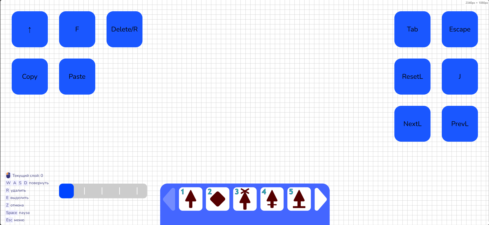

# Layers-DLC
Добавляет в игру слои для упрощения строительства разных схем с большим количеством плотно установленных проводов.

**Мод является ванильным**, что означает что он полностью совместим с ванильной игрой, все карты и схемы которые были сделаны с модом будут работать в ванильной игре ( без слоёв ).

Слои являются только визуальной частью, в одной клеточке может быть только одна стрелочка.

### Управление
**Текущий слой показывается в подсказке слева снизу, если нету то необходимо включить подсказки в настройках.**

На -1 слое видны все стрелочки, при поставке стрелочек они будут установлены на 0 слое. Максимально 255 слоёв.
На -2 слое видны все зоны, стрелочки никаким образом нельзя поставить.

Стрелочки на других слоях защищены, их нельзя как либо изменить без `SHIFT`. Сделано чтобы предотвратить ошибки.

Слой на котором установлена стрелочка меняется при изменении типа стрелочки, или при любом изменении с зажатым `CTRL`.

При копировании скопируются все стрелочки со всех слоёв, но ставиться будут только стрелочки текущего слоя, чтобы поставить все стрелочки необходимо зажать `SHIFT`, но их слои сохранятся, чтобы поставить все стрелочки на текущем слое нужно зажать `CTRL`.

Размер карты зависит от того насколько сильно используются слои, также на это влияет коэффицент сжатия, в сохранении используется алгоритм DEFLATE, он может намного сильно уменьшить размер слоёв.

Управление ( ПК / Телефон )

`T`/`NextL` - Следующий слой

`G`/`PrevL` - Предыдущий слой

`U`/`ResetL` - Возврат на 0 слой

`J`/`J` - Перемещает стрелочку под курсором на текущий слой

`SHIFT`/`-` - Принудительно изменить стрелочку, но слой не изменится.

`CTRL`/`-` - Принудительно изменить стрелочку и переместить на текущий слой.

`CTRL+I`/`-` - Создать зону от выделенных стрелочек ( Зона будет от левой верхней до правой нижней стрелочки )

`I`/`-` - Открыть настройки зоны ( описание показывается только в настройках ).

### Установка и обновление `Layers-DLC` на пк
1. Скачайте `zip` файл через `Code` и `Download Zip`.
2. Распакуйте `zip` файл.
3. Откройте `chrome://extensions` ( Только браузеры на основе Chromium ).
4. Включите `Режим разработчика`.
5. Если он `Layers-DLC` уже установлен, то необходимо удалить.
6. Загрузите `Layers-DLC` через `Загрузить распакованное расширение`.

### Установка `Layers-DLC` на телефон
1. Скачайте `via-main.js` файл.
2. Скачайте браузер Via.
3. В настройках выберите `Скрипты`, далее `+`, потом нажимаете `Импорт скрипта из файла` и выбираете `via-main.js`
4. Скрипт автоматически берёт самую последнюю версию `Layers-DLC`.
